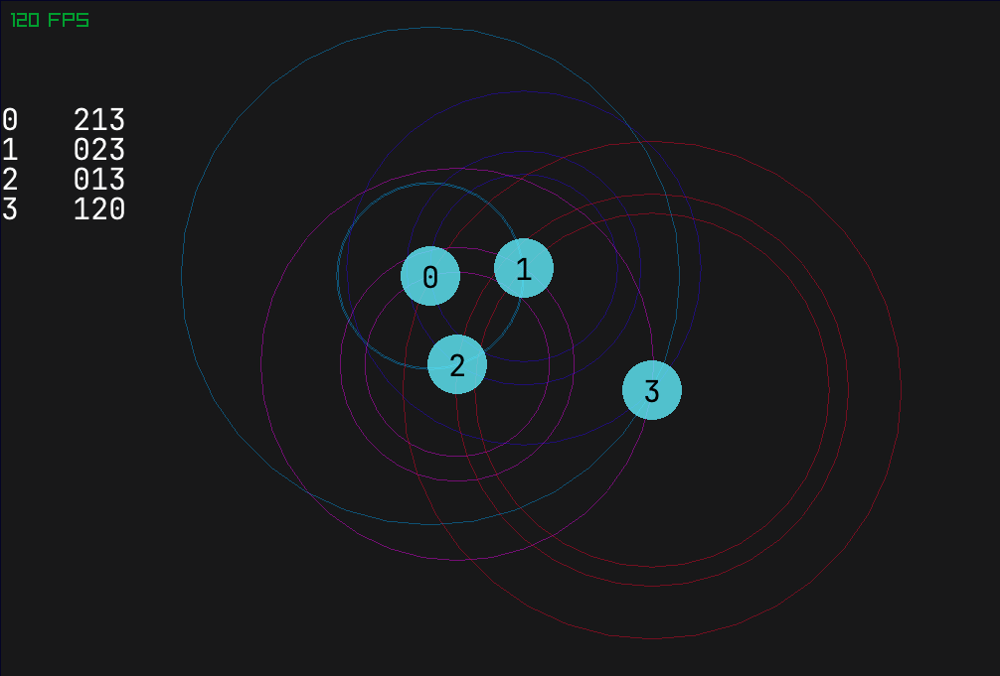

## Running

Install [Odin](https://odin-lang.org/), then run:
```
odin run .
```



## Controls
Double-click to create a new point\
Right-click to delete a point\
Hold left-click to select multiple points. Move them or press Delete to delete the selected points

